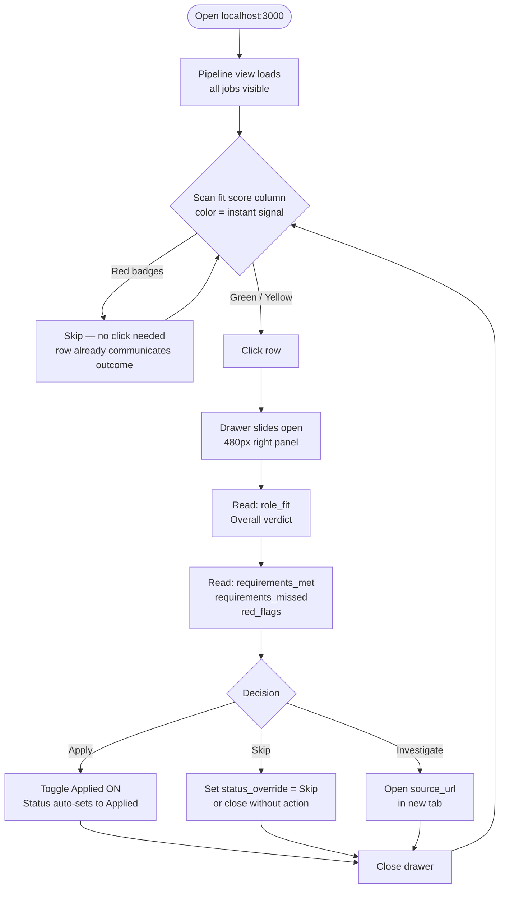
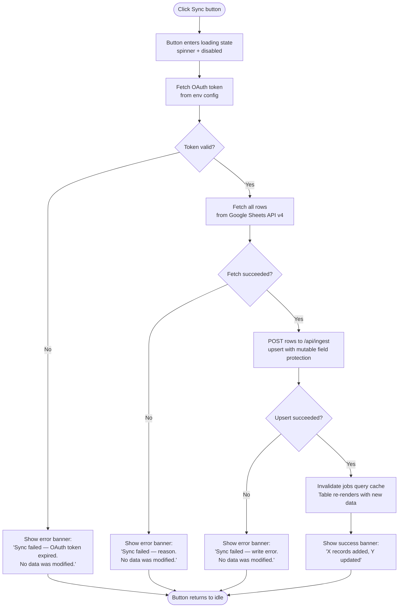
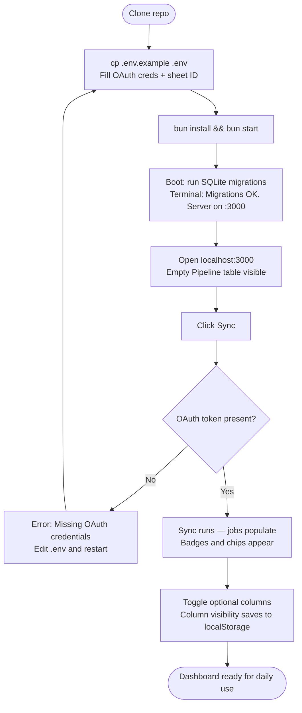

# UX Design Specification — Job Hunt Dashboard

**Author:** Stryker
**Date:** 2026-03-27

---

<!-- UX design content will be appended sequentially through collaborative workflow steps -->

## Executive Summary

### Project Vision

Job Hunt Dashboard is a personal decision surface for job hunting — not a tracker, not a data entry
tool. Every record arrives pre-scored from an upstream Google Sheets + Claude pipeline. The dashboard's
sole UX responsibility is to surface that intelligence efficiently so the user can make fast, confident
triage decisions without opening any other tool.

The defining UX principle: **the AI has already decided — the interface presents the conclusion.**

### Target Users

**Primary User: Stryker (single user)**
- Technically fluent; comfortable with dense, information-rich interfaces
- Experiences decision fatigue during active job searching
- Works exclusively on desktop (Firefox); no mobile consideration needed
- Has an existing technical workflow (Google Sheets + Claude pipeline); this dashboard is the
  consumption layer for that investment
- Values speed and signal over polish and hand-holding

### Key Design Challenges

1. **Density vs scanability** — The pipeline table must hold enough records to review in one session
   without becoming a wall of noise. Fit score and action chip must communicate intent before a
   single text label is read.

2. **The drawer as decision moment** — When a user opens a drawer, they are in the act of deciding.
   The drawer layout must answer "should I apply?" in a single visual pass: score → gaps → Claude's
   reasoning → apply action. Nothing should be buried.

3. **Visual aging calibration** — Opacity/color decay must feel like natural information, not a UI
   glitch. Old applications should feel aged; the effect must be smooth and purposeful.

### Design Opportunities

1. **Fit score color as pre-attentive signal** — Red/yellow/green badges communicate quality
   distribution across the entire table before any text is processed. The column becomes a
   heat map of opportunity.

2. **Action chip as AI voice** — The `skip / investigate / apply` chip is the most powerful
   affordance in the UI: it translates a numeric score into a direct recommendation. This chip
   should be visually prominent and styled to feel like a recommendation, not a label.

3. **Zero-friction decision capture** — The applied toggle should be a single-click interaction
   with immediate visual confirmation. The drawer should remain open post-toggle so the user
   retains context and can review what they just committed to.

## Core User Experience

### Defining Experience

The core loop is: **scan → evaluate → decide**. The user opens the dashboard, scans the pipeline
table for high-signal rows (fit score color, action chip), clicks a row to open the detail drawer,
reads the AI analysis, and makes a triage decision. Everything in the product exists to make this
loop faster and less cognitively taxing.

The core action that must be perfected: **opening a job record and making a decision in under
10 seconds.**

### Platform Strategy

- **Platform:** Desktop web application, localhost only
- **Browser:** Firefox latest — no cross-browser adaptation needed
- **Input:** Mouse + keyboard; touch not considered
- **Layout:** Dense table-first UI; responsive adaptation not required
- **Display:** Single-monitor desktop; assume adequate horizontal space for full table columns

### Effortless Interactions

These interactions must require zero cognitive overhead:

1. **Row → drawer** — single click anywhere on a row opens the detail drawer instantly; no loading
   state (data already in cache); no modal confirmation
2. **Applied toggle** — one click; immediate visual confirmation on the toggle itself; drawer
   remains open so the user retains context
3. **Sync** — one button; spinner during operation; clear success/failure message; no anxiety
   about data integrity
4. **Column visibility toggle** — show/hide optional columns without losing current scroll position
   or table state; preference persists automatically

### Critical Success Moments

1. **Table first load** — Within 1–2 seconds of opening the app, the pipeline table is populated
   with color-coded fit score badges. The user immediately knows which rows to look at without
   reading a single label. This is the product's first impression.

2. **Drawer first open** — The user clicks a row and sees: fit score → requirements met/missed →
   Claude's explanation → apply button. All in one visual pass, no scrolling. This is where the
   product earns its keep daily.

3. **Post-sync integrity confirmation** — After hitting Sync, the user spot-checks a job they
   already marked as applied. It's still applied. The sync result says "0 records corrupted."
   Trust is established. The product becomes the reliable daily tool it's meant to be.

### Experience Principles

1. **Signal before text** — Color, shape, and visual weight communicate intent before any label
   is parsed. The fit score column is a heat map; the action chip is a voice; row opacity is a
   timeline. Visual encoding is the first language.

2. **Every decision is one action** — `apply`, `skip`, `status override` — all reachable in a
   single click from wherever the user is in the interface. No confirmation dialogs for routine
   decisions.

3. **Data integrity as felt trust** — Sync is safe by design, and the user must *feel* that
   safety. Idempotent behavior, atomic writes, and clear feedback after every sync operation
   build the trust that makes this the user's primary tool.

4. **Ambient communication, not labels** — Visual aging replaces "ghosted." Color-coded scores
   replace threshold explanations. The interface communicates through design, not through
   additional text fields.

## Desired Emotional Response

### Primary Emotional Goals

**Primary: Calm, focused control.**
Job hunting is inherently stressful — sustained uncertainty and decision fatigue are the backdrop
for every session. The dashboard must work against that context. The user should arrive, see the
situation clearly, act decisively, and leave feeling like they accomplished something real.
Not anxious. Not overwhelmed. In command.

**Secondary: Sharp efficiency.**
Every interaction should feel clean and fast. The user should feel like they are cutting through
noise, not wading through it. Completing 9 triage decisions in 8 minutes should feel satisfying,
not exhausting.

### Emotional Journey Mapping

| Stage | Desired Emotion | Trigger |
|---|---|---|
| App opens | Oriented, clear | Color-coded scores visible before reading labels |
| During triage | Sharp, efficient | Action chip removes ambiguity; one-click decisions |
| After applying | Momentum, progress | Applied toggle confirmation; task was completed |
| After sync | Trust, relief | Applied states survived; clear success message |
| Error state | Informed, not alarmed | Clear error message; explicit "no data was modified" |
| Returning user | Familiarity, routine | Same layout, same behavior — no surprises |

### Micro-Emotions

- **Confidence** — color-coding tells the user where to look before a label is read; no guessing
- **Clarity** — the action chip translates a score into a recommendation; the user decides if they
  agree, not what the score means
- **Satisfaction** — decision volume (X decisions in Y minutes) is the product's primary reward
- **Trust** — user-owned fields survive every sync; the tool is predictable and safe
- **Relief** — error messages explicitly confirm data was not modified; no "did it break something?"

### Emotions to Avoid

- **Anxiety** about data loss — sync must feel atomic and safe by design
- **Overwhelm** from visual noise — density must always feel organized, never chaotic
- **Uncertainty** about next action — action chip and clear visual hierarchy eliminate this
- **Friction frustration** — no confirmation dialogs for routine low-stakes decisions

### Design Implications

| Emotional Goal | UX Design Approach |
|---|---|
| Calm, focused control | Muted/neutral base palette; reserved colors carry meaning (score badges only) |
| Sharp efficiency | Tight row height; no wasted whitespace; keyboard-navigable table rows |
| Momentum after applying | Subtle toggle confirmation animation; applied count visible in header/status bar |
| Trust from sync | Sync result message persists until dismissed (not auto-dismissing toast) |
| Informed error handling | Error banner explicitly states "no data was modified" — not just the error type |

### Emotional Design Principles

1. **Reduce ambient anxiety** — every design choice that could introduce uncertainty (ambiguous
   labels, unclear sync state, data loss risk) must be resolved in favor of clarity and safety
2. **Reward decisiveness** — small moments of feedback after each decision (toggle confirms,
   count updates) reinforce that the user is making progress
3. **Never alarm unnecessarily** — visual changes (row aging, color badges) communicate passively;
   they should never feel like warnings or alerts
4. **Familiarity as comfort** — a consistent, predictable layout means the returning user feels
   at home immediately; no relearning, no surprises

## UX Pattern Analysis & Inspiration

### Inspiring Products Analysis

**GitHub (Issues / Pull Requests)**
- Dense tabular list with compact rows — status, labels, and metadata visible without expanding
- Color-coded label system communicates category and priority before text is read
- Inline state transitions (close, merge, react) without leaving list context
- Detail view hierarchy: title → status → metadata → body → timeline — everything has a defined place
- Keyboard navigation and shortcuts respected throughout

**n8n (Workflow Editor)**
- Right-side configuration panel slides in on node click — context (canvas) remains visible
- Muted/neutral base palette; color appears only where it carries semantic meaning (node execution state)
- Node status badges: color + icon communicate state before label is read (green = success, red = error)
- Panel sections are clearly separated; most important controls are highest in the layout

### Transferable UX Patterns

**Navigation Patterns:**
- **Right-side slide panel (n8n)** — row click opens detail panel from the right; main list remains
  visible and oriented; directly maps to our JobDrawer pattern
- **List-stays-visible on detail open** — the user never loses their place in the table when
  reviewing a job record

**Interaction Patterns:**
- **Inline state transitions (GitHub)** — applied toggle and status override live in the drawer,
  not on a separate edit page; state changes without navigation
- **Compact row with pre-attentive signals (GitHub issues)** — fit score badge + action chip
  communicate the essential information before any text label is processed

**Visual Patterns:**
- **Semantic color only (n8n)** — muted neutral base; color reserved for fit score badges
  (green/yellow/red) and action chip styling; never decorative
- **Badge-first status communication (GitHub labels)** — colored badges carry meaning before
  text; the table column becomes a visual heat map

### Anti-Patterns to Avoid

- **Text-heavy detail views (GitHub issue body)** — the drawer must be scannable, not readable;
  structured sections and short labels, not prose paragraphs
- **Badge proliferation** — the fit score badge is the primary signal; avoid multiplying badge
  types (don't add separate "urgent" or "new" badges that dilute the score's prominence)
- **Panel complexity creep (n8n node config)** — the drawer should surface the most important
  information immediately; don't expose every field at equal visual weight
- **Navigation away for routine actions** — applying to a job, overriding a status — these must
  never require leaving the current context

### Design Inspiration Strategy

**Adopt directly:**
- n8n's right-side panel slide pattern for JobDrawer
- n8n's "color only where it means something" palette rule
- GitHub's compact row density with pre-attentive badge signals
- GitHub's inline state change pattern (no separate edit pages)

**Adapt:**
- GitHub's detail view top-to-bottom priority hierarchy → drawer layout: score breakdown →
  requirements met/missed → Claude explanation → action controls
- GitHub's label color semantics → fit score badge: ≥80 green, 60–79 yellow, <60 red

**Avoid:**
- Prose-heavy detail sections — use structured data, not paragraphs, in the drawer
- Decorative color — every color used must carry information
- Any interaction that navigates away from the table for a routine triage decision

## Design System Foundation

### Design System Choice

**shadcn/ui + Tailwind CSS** — selected in architecture, confirmed here.

shadcn/ui is a copy-paste component library built on Radix UI primitives with Tailwind CSS.
Components live in the codebase (`src/client/components/ui/`), not in a node_modules package —
giving full ownership and zero upstream breakage risk.

### Rationale for Selection

- **Component ownership** — components are part of the codebase; customizable without fighting
  library APIs
- **Radix UI accessibility** — keyboard navigation, focus traps, ARIA attributes handled correctly
  out of the box (critical for Sheet/drawer pattern)
- **Tailwind CSS variable theming** — dark mode, semantic color tokens, and density all controlled
  through CSS custom properties
- **shadcn Sheet component** — the right-side slide panel pattern (identified from n8n inspiration)
  is a first-class primitive in shadcn, not a workaround
- **Single-user personal tool** — no need for enterprise design system overhead; shadcn's lean
  approach is a strength here

### Implementation Approach

```bash
bunx shadcn@latest init   # sets up components.json, globals.css, tailwind config
bunx shadcn@latest add sheet badge button select toast separator
```

Components added to `src/client/components/ui/` and owned by the project from that point forward.

### Customization Strategy

**Theme: Dark mode base**
The tool is used daily for focused work sessions. Dark base palette reduces eye strain, and
semantic badge colors (green/yellow/red) pop with stronger contrast against dark backgrounds.
Aligns with n8n aesthetic precedent.

**Semantic Color Tokens (defined in `globals.css`):**

| Token | Usage | Tailwind Color |
|---|---|---|
| `--score-high` | Fit score ≥80 badge | `emerald-500` |
| `--score-mid` | Fit score 60–79 badge | `amber-400` |
| `--score-low` | Fit score <60 badge | `red-500` |
| `--action-apply` | Apply chip accent | `blue-500` |
| `--action-investigate` | Investigate chip | `amber-500` |
| `--action-skip` | Skip chip | `zinc-500` (muted) |

**Density Configuration:**
- Table row padding: `py-1.5 px-3` (tighter than shadcn defaults)
- Table cell font: `text-sm` across all columns
- Drawer width: `480px` fixed — wide enough for fit breakdown, doesn't dominate screen

**shadcn Components Used:**

| Component | Usage |
|---|---|
| `Sheet` | JobDrawer — right-side slide panel |
| `Badge` | FitScoreBadge, ActionChip |
| `Button` | SyncButton, AppliedToggle |
| `Select` | StatusOverride dropdown |
| `Toast` | Job update feedback (transient) |
| `Separator` | Drawer section dividers |

## Core Experience Deep Dive

### Defining Experience

**"Click a job row, read the AI's verdict, decide in 10 seconds."**

The defining interaction is the triage loop: scan → click → read → decide. If this feels fast,
clean, and trustworthy, everything else follows. If it feels slow, cluttered, or uncertain,
the product fails its core purpose regardless of other features.

### User Mental Model

**Current state (problem being solved):**
Job hunting currently requires context-switching across multiple tools — Sheets for raw data,
job postings for descriptions, email for status. The user must assemble the picture before
every decision. This is cognitively expensive and creates fatigue.

**Mental shift this product creates:**
The dashboard delivers *conclusions*, not datasets. The user arrives at a pre-assembled
recommendation (score + gaps + reasoning) and decides whether they agree. The job is
not "research this opportunity" — it is "confirm or override this assessment."

This is a significant mental model shift that the UI must support by presenting the AI's
recommendation as the primary visual entry point, not the job title or company name.

### Success Criteria

The core triage loop is successful when:
- The user makes a decision (skip / investigate / apply) without scrolling in the drawer
- The fit score badge is the first visual element the eye lands on when the drawer opens
- Applied toggle confirmation is visible within 200ms of clicking
- Closing the drawer and opening the next record feels like flipping a card, not navigating
- The user never thinks about the mechanism — only the decision

### Novel UX Patterns

**Pattern 1 — Pre-scored dossier (novel):**
The AI recommendation is surfaced *first* in the drawer layout — before the job title is
prominently displayed, before the description is shown. This is backwards from conventional
job browsing. It must feel like a trusted advisor presenting a briefing, not a spoiler
disrupting the user's own evaluation. Implementation: score + recommendation chip appear at
the top of the drawer; job description is below the fold.

**Pattern 2 — Visual aging as passive state (novel):**
Row opacity decays over time without any explicit "ghosted" status field. First-time users
may not immediately understand why rows look different. Mitigation: hover tooltip on any
row reveals "Applied N days ago" regardless of opacity level. The pattern teaches itself
within one session.

**Pattern 3 — Established: table + right-side panel:**
Row click → Sheet slide from the right. Context (table) remains visible behind the panel.
Users already understand this from n8n, Linear, and similar tools. No education needed.

### Experience Mechanics

**The triage loop in detail:**

**1. Initiation — Table scan**
- User opens `localhost:3000`; Pipeline view loads
- TanStack Query fetches all jobs; table renders with color-coded fit score badges
- Eye is drawn to green badges (≥80) before any text is processed
- Action chip (skip/investigate/apply) is visible in the same row — the AI has already voted

**2. Interaction — Drawer open**
- User clicks anywhere on a row
- shadcn `Sheet` slides in from the right at ~300ms transition
- Data is already in TanStack Query cache — no loading state, no spinner
- Drawer layout top-to-bottom: fit score badge (large) → recommendation chip → score
  breakdown (reqs met/missed) → Claude's explanation → job description → source URL →
  applied toggle → status override → status timeline (post-MVP)

**3. Decision and feedback**
- User reads score breakdown and Claude's explanation — the two most decision-relevant items
- User either:
  - Toggles **Applied** → toggle animates to checked state immediately (optimistic update);
    drawer remains open; row in background table gains an "applied" visual indicator
  - Sets **Status Override** (skip/investigate) → select updates immediately; row action
    chip updates in background table
  - Closes drawer without action → no state change; row unchanged

**4. Completion — Next record**
- User closes drawer (click outside, Escape key, or explicit close button)
- Table is visible, unchanged except for the row just acted on
- User scrolls to next row of interest and repeats
- Session ends when user has processed the rows they care about — no "done" state needed

## Visual Design Foundation

### Color System

**Base palette (dark mode — shadcn/ui CSS variables in `globals.css`):**

| Role | CSS Variable | Tailwind Equivalent | Hex |
|---|---|---|---|
| Background | `--background` | `zinc-950` | `#09090b` |
| Surface (cards, drawer) | `--card` | `zinc-900` | `#18181b` |
| Surface elevated | `--popover` | `zinc-800` | `#27272a` |
| Border | `--border` | `zinc-700` | `#3f3f46` |
| Text primary | `--foreground` | `zinc-100` | `#f4f4f5` |
| Text muted | `--muted-foreground` | `zinc-400` | `#a1a1aa` |
| Interactive hover | `--accent` | `zinc-800` | `#27272a` |
| Focus ring | `--ring` | `blue-600` | `#2563eb` |

**Semantic score colors (custom tokens):**

| Token | Condition | Color | Hex |
|---|---|---|---|
| `--score-high` | Fit score ≥80 | `emerald-500` | `#10b981` |
| `--score-mid` | Fit score 60–79 | `amber-400` | `#fbbf24` |
| `--score-low` | Fit score <60 | `red-500` | `#ef4444` |

**Semantic action chip colors:**

| Token | Action | Color | Hex |
|---|---|---|---|
| `--action-apply` | Apply | `blue-500` | `#3b82f6` |
| `--action-investigate` | Investigate | `amber-500` | `#f59e0b` |
| `--action-skip` | Skip | `zinc-500` | `#71717a` (muted) |

**Color rule:** Color appears only where it carries semantic meaning — score badges,
action chips, and interactive focus states. The base UI is neutral zinc throughout.
No decorative color.

### Typography System

**Font family:** Inter (variable font) — standard for data-dense UIs; matches the GitHub/n8n
aesthetic precedent. Loaded as a local variable font to avoid network dependency.

**Fallback stack:** `Inter, system-ui, -apple-system, sans-serif`

**Type scale:**

| Role | Size | Weight | Line Height | Usage |
|---|---|---|---|---|
| Drawer title | `text-lg` (18px) | `font-semibold` | `1.4` | Job title in drawer header |
| Section heading | `text-sm` (14px) | `font-medium` | `1.5` | Drawer section labels |
| Table cell | `text-sm` (14px) | `font-normal` | `1.4` | All table data |
| Table header | `text-xs` (12px) | `font-medium uppercase` | `1.5` | Column headers |
| Metadata / muted | `text-xs` (12px) | `font-normal` | `1.4` | Date, source URL, counts |
| Score badge | `text-xs` (12px) | `font-bold` | `1` | Score number in badge |
| Action chip | `text-xs` (12px) | `font-medium` | `1` | skip/investigate/apply |

**Typography rules:**
- No large display text — this is a data tool, not a marketing page
- All table text is `text-sm` or smaller — density is intentional
- Claude's explanation text in drawer: `text-sm` with `leading-relaxed` — the one piece of
  content meant to be read, not scanned

### Spacing & Layout Foundation

**Base unit:** 4px (Tailwind default `space-1`)

**Table density (tight):**
- Row padding: `py-1.5 px-3` (6px vertical, 12px horizontal)
- Column gap: managed by table cell padding
- Header row: `py-2 px-3`

**Drawer layout:**
- Drawer width: `w-[480px]` fixed
- Internal padding: `p-6` (24px)
- Section spacing: `space-y-4` (16px between sections)
- Separator between major sections (score → explanation → actions)

**App shell:**
- Header bar height: `h-14` (56px) — fixed top; contains view tabs + sync button
- Table fills remaining viewport height: `h-[calc(100vh-56px)]` with overflow scroll
- No sidebar — full-width table

**Grid/layout principles:**
- No grid system needed — single-column layout (header + full-width table)
- Drawer is a fixed overlay; does not push table content
- Table columns: fixed widths for badge/chip columns; flexible width for company/title

### Accessibility Considerations

- **Contrast:** All text on dark backgrounds meets WCAG AA minimum (4.5:1 for normal text,
  3:1 for large text) — zinc-100 on zinc-950 = ~16:1 ratio
- **Score badge contrast:** emerald-500/amber-400/red-500 on zinc-900 card surface — verified
  adequate for badge text readability
- **Focus management:** shadcn `Sheet` (Radix UI) handles focus trap on drawer open; Escape
  key closes drawer; focus returns to triggering row on close
- **Keyboard navigation:** Table rows navigable via keyboard (TanStack Table + tabIndex);
  drawer controls (toggle, select) are standard HTML elements with native keyboard support
- **No motion requirement:** Visual aging uses CSS `opacity` only — no animation; respects
  `prefers-reduced-motion` automatically

---

## Design Direction Decision

### Design Directions Explored

Six directions were explored, each built on the established visual foundation (zinc-950, Inter, semantic score colors):

- **A — Zinc Command:** Tight `py-1.5` rows, bordered score badges, dense table. The baseline.
- **B — Terminal Flat:** JetBrains Mono, text-only score indicators, monochrome with green-only accent.
- **C — Elevated Card:** Table in a rounded card container with visible border; backdrop-blur sticky header; slightly more structured "app" feel while keeping row density.
- **D — Warm Slate:** Slate-900 base (blue-gray undertones), same bordered badge treatment as A.
- **E — High Signal:** Solid filled score badges (white text on color), uppercase bold action chips. Maximum contrast.
- **F — With Drawer Open:** Direction A table + full drawer layout — Claude assessment, applied toggle, status override.

### Chosen Direction

**Direction C (Elevated Card) with Direction F's drawer.**

Table view: rounded card container, visible card border on zinc-900 background, backdrop-blur sticky header. Rows remain dense (`py-1.5`), score badges use the outlined/bordered style.

Drawer: 480px fixed right panel — score badge, action chip, Claude's assessment section, job description, source URL, applied toggle, status override.

### Claude Assessment Fields

The drawer's AI analysis section renders four long-text fields:

| Field | Description |
|---|---|
| `role_fit` | Claude's overall fit assessment |
| `red_flags` | Concerns, gaps, or risks identified |
| `requirements_met` | Requirements the candidate satisfies |
| `requirements_missed` | Requirements the candidate does not meet |

Each field is a full paragraph string rendered as readable prose. Display order in drawer: `role_fit` → `requirements_met` → `requirements_missed` → `red_flags` — positive signal first, gaps second, concerns last.

### Design Rationale

Direction C adds just enough visual structure to separate the table from the page without sacrificing density. The card border makes the table a contained, scannable object. Backdrop-blur sticky header keeps column labels visible during scroll — matters for 8+ visible columns.

Direction F's drawer was the clear choice: score + verdict at top, structured assessment in the middle, action controls at the bottom. The four named prose fields (`role_fit`, `red_flags`, `requirements_met`, `requirements_missed`) replace the previously unspecified "fit score breakdown + Claude explanation" with an exact rendering contract.

### Implementation Approach

- Card container: `rounded-lg border border-zinc-800 bg-zinc-900 overflow-hidden`
- Sticky header: `sticky top-0 backdrop-blur-sm bg-zinc-900/80 border-b border-zinc-800`
- Row padding: `py-1.5 px-3`
- Score badges: outlined — `border border-emerald-600 text-emerald-400 bg-transparent` (color-swapped per score tier)
- Drawer: shadcn `<Sheet side="right">`, 480px fixed width
- Assessment rendering: four labeled prose blocks in order — `role_fit`, `requirements_met`, `requirements_missed`, `red_flags`; plain `<p>` tags, no markdown parsing needed for MVP

---

## User Journey Flows

### Journey 1: Daily Triage

The primary loop. Entry is the Pipeline view; the exit is either a decision recorded or the tab closed.



**Flow optimizations:**
- Score badge color resolves most decisions before the drawer opens — the drawer is for confirmation, not discovery
- Applied toggle is at the bottom of the drawer; user reads the full record before the action is reachable
- Closing the drawer without action is a valid non-decision — no forced choice

### Journey 2: Manual Sync

Triggered by the Sync button. Two branches: success and auth/network failure.



**Flow optimizations:**
- Every failure path guarantees no partial writes — atomic-or-nothing semantics
- Success banner shows counts (not just "done") — gives confidence the sync was meaningful
- Second sync immediately after is safe; idempotent result shown

### Journey 3: First-Run Setup

Single-session bootstrap from clone to live data.



### Journey Patterns

**Decision before action:** Every state-changing action (applied toggle, status override) is positioned below the full record in the drawer. The user reads before they act — layout enforces this.

**Non-action is valid:** Closing the drawer without toggling anything is a valid "investigate later" signal. No forced confirmation dialogs.

**Error isolation:** All sync errors include "No data was modified" — removes anxiety about running sync repeatedly.

**Score-first scanning:** The leftmost prominent column is always the fit score badge. Color is absorbed before text is read in any view.

### Flow Optimization Principles

- **Reduce time-to-first-decision:** Score color resolves ~60% of records without opening a drawer
- **Drawer = confirmation, not discovery:** The user already suspects "apply" or "skip" before clicking — the drawer provides evidence, not the verdict
- **No modals, no confirmations:** Applied toggle and status override are direct writes; undo is just toggling back
- **Sync is always safe to re-run:** Idempotent upsert removes hesitation about hitting Sync more than once

---

## Component Strategy

### Design System Components (shadcn/ui)

These shadcn primitives are used directly with minimal customization:

| Component | Usage |
|---|---|
| `Sheet` | Detail drawer — `side="right"`, 480px fixed width |
| `Badge` | Base for ScoreBadge and ActionChip (extended with custom variants) |
| `Button` | Sync button, column visibility toggle trigger |
| `Switch` | Applied toggle in drawer |
| `Select` | Status override dropdown in drawer |
| `Separator` | Section dividers in drawer |
| `Tooltip` | Visual aging fallback — "Applied 18 days ago" on row hover |
| `DropdownMenu` | Column visibility toggle menu |
| `Skeleton` | Table loading state during initial data fetch |
| `Alert` | Sync result feedback (success and error banners) |

TanStack Table provides table logic (sorting, column visibility, row selection); shadcn `Table` markup (`<TableHeader>`, `<TableRow>`, `<TableCell>`) provides the DOM structure.

### Custom Components

#### `ScoreBadge`

**Purpose:** Display fit score as a color-coded visual indicator — the primary triage signal.

**Anatomy:** Outlined badge — border + text in tier color, transparent background. Number displayed; tier label hidden in tight table rows.

**Variants:**

| Score range | Color tier | Classes |
|---|---|---|
| 75–100 | Emerald (apply) | `border-emerald-600 text-emerald-400` |
| 50–74 | Amber (investigate) | `border-amber-500 text-amber-400` |
| 0–49 | Red (skip) | `border-red-700 text-red-500` |

**States:** Default only — pure display, no interaction.

**Props:** `score: number` — derives color tier internally.

---

#### `ActionChip`

**Purpose:** Display the AI-recommended action (skip/investigate/apply) as a compact visual chip.

**Anatomy:** Small rounded badge, subtle background tint, no border.

**Variants:**

| Action | Classes |
|---|---|
| `apply` | `bg-blue-950 text-blue-300` |
| `investigate` | `bg-amber-950 text-amber-300` |
| `skip` | `bg-zinc-800 text-zinc-400` |

**States:** Default only — display component, not interactive.

**Props:** `recommendation: 'apply' | 'investigate' | 'skip'`

---

#### `AgingRow`

**Purpose:** Apply time-decay opacity to table rows in Tracker view, communicating staleness without an explicit "ghosted" label.

**Anatomy:** Wrapper around `<TableRow>` that injects computed `opacity` style based on `daysSinceApplication`.

**Opacity tiers:**

| Days since application | Opacity |
|---|---|
| 0–7 | 1.0 |
| 8–14 | 0.75 |
| 15–21 | 0.55 |
| 22+ | 0.35 |

**Props:** `appliedAt: string | null` — computes days diff at render time. If null, renders at full opacity.

---

#### `AssessmentSection`

**Purpose:** Render one of the four Claude assessment fields as a labeled prose block in the drawer.

**Anatomy:** Small uppercase label (`text-xs text-zinc-500 uppercase tracking-wide`) above a `<p>` of body text (`text-sm text-zinc-200 leading-relaxed`).

**Props:** `label: string`, `content: string | null` — renders nothing if content is null/empty.

**Usage:** Rendered four times in sequence: `role_fit` → `requirements_met` → `requirements_missed` → `red_flags`.

---

#### `SyncButton`

**Purpose:** Trigger Sheets sync with loading state and inline result feedback.

**States:**
- **Idle:** "Sync" label, enabled
- **Loading:** Spinner icon + "Syncing…", disabled
- **Success:** Brief green tint + "15 added, 47 updated" (auto-dismisses after 3s, returns to idle)
- **Error:** Brief red tint + truncated error message (persists until next click)

Wraps `useMutation` from TanStack Query — manages state internally.

---

#### `StatusTimeline`

**Purpose:** Show chronological status events for a job record in the drawer.

**Anatomy:** Vertical list of timestamped entries — dot indicator + status label + formatted date. Most recent at top.

**States:** Empty state shows "No status history yet."

**Props:** `events: Array<{ status: string; timestamp: string }>`

---

### Component Implementation Strategy

- All custom components live in `src/client/components/jobs/` (e.g., `ScoreBadge.tsx`, `ActionChip.tsx`)
- Custom components use Tailwind utility classes only — no CSS modules, no inline style objects except computed `opacity` in `AgingRow`
- shadcn components extended via `className` prop only — never modified in `components/ui/`
- No barrel re-exports — components imported directly from their file

### Implementation Roadmap

**Phase 1 — Pipeline view (core triage):**
- `ScoreBadge`, `ActionChip`, `SyncButton`, `Sheet` (drawer shell)

**Phase 2 — Drawer (decision moment):**
- `AssessmentSection` × 4, `Switch` (applied toggle), `Select` (status override), `StatusTimeline`

**Phase 3 — Tracker view:**
- `AgingRow`, `Tooltip` (aging hover fallback)

---

## UX Consistency Patterns

### Feedback Patterns

**Sync result feedback** — inline `Alert` below the header bar, not a floating toast. Persists until dismissed or next sync. Two variants:

- **Success:** `variant="default"` with green border tint — "15 records added, 47 updated." Auto-dismisses after 4s.
- **Error:** `variant="destructive"` — "Sync failed — OAuth token expired. No data was modified." Persists until next sync attempt.

**Applied toggle feedback** — no toast. The `Switch` flips immediately (optimistic); the row in Tracker view gains the applied date. The state change is the feedback.

**Status override feedback** — no toast. The `Select` shows the new value; the drawer reflects it immediately.

**Rule:** No floating toasts anywhere. All feedback is inline and contextual to the triggering element or view.

### Loading & Empty States

**Initial table load** — `Skeleton` rows (5–8 rows of shimmer) while TanStack Query fetches. Column structure preserved so the layout doesn't shift.

**Empty table (no data)** — centered empty state inside the card: "No jobs yet. Hit Sync to pull from Google Sheets." Single `Button` shortcut to trigger sync.

**Empty drawer field** — `AssessmentSection` renders nothing if `content` is null. No "N/A" placeholder — absent fields are simply absent.

**Sync button loading** — button disabled + spinner inline. Table remains fully interactive during sync; data refreshes when invalidation resolves.

### Table Interaction Patterns

**Row click** — entire row is the click target. Opens the drawer for that job. No separate action column.

**Active row** — selected row gets `bg-zinc-800` highlight while drawer is open. Clears on drawer close.

**Column visibility** — `DropdownMenu` in the header toolbar. Checkboxes per optional column (`reqs_met`, `reqs_missed`, `notes`). Persists to `localStorage` under key `job-dashboard:column-visibility`. All columns shown on first load.

**Sorting** — click column header to sort ascending; click again for descending. Fit score sorts descending by default. No multi-column sort.

**No row selection checkboxes** — not a bulk-action interface. One drawer at a time.

### Drawer Patterns

**Open:** Click any table row → `Sheet` slides in from right. Table remains visible behind the overlay.

**Close:** Escape key, click outside the drawer, or close button (`×` top-right). Focus returns to the triggering row.

**Scroll:** Drawer content scrolls independently. Header sticky within the drawer.

**Content order (top to bottom):**
1. Sticky header — company, job title, `ScoreBadge`, `ActionChip`
2. `AssessmentSection` × 4 — `role_fit`, `requirements_met`, `requirements_missed`, `red_flags`
3. `Separator`
4. Job description (collapsible — show first 300 chars, "Show more" toggle)
5. Source URL — external link icon, opens in new tab
6. `Separator`
7. Applied toggle (`Switch` + label + date if applied)
8. Status override (`Select`)
9. `StatusTimeline`

**One drawer at a time** — clicking a different row while drawer is open replaces content without closing/reopening animation.

### Navigation Patterns

**View switching (Pipeline / Tracker)** — two tabs in the header. Active tab: `text-zinc-100` + bottom border. Inactive: `text-zinc-500`. View state is local React state — always opens to Pipeline on load.

**No routing** — view switch is local state, not a URL change. TanStack Router reserved for post-MVP deep-linking.

**Header layout:** App name (left) → View tabs (center) → `SyncButton` + column visibility toggle (right).

### State Transition Rules

**Optimistic updates:** Applied toggle and status override write optimistically via `useMutation`. On error, mutation rolls back and shows inline error in the drawer.

**No confirmation dialogs:** All writes are immediately reversible — toggle back, change the select. No confirmations for a single-user tool.

**Query invalidation:** Only `POST /api/sync` invalidates the full `['jobs']` list. PATCH mutations update `['jobs', id]` optimistically — no full refetch.

---

## Responsive Design & Accessibility

### Responsive Strategy

**Desktop-only. No responsive adaptation.**

The dense table UI is an intentional design decision. The layout is fixed-width desktop; no breakpoints, no mobile layout, no tablet consideration. Tailwind responsive prefixes (`sm:`, `md:`, `lg:`) are not used except where a shadcn component applies them internally.

Minimum comfortable viewport: ~1280px wide. The 480px fixed drawer leaves ~800px for the table at that width.

### Breakpoint Strategy

None. No breakpoints defined or implemented.

### Browser Strategy

**Firefox (latest) — only target.**

No cross-browser polyfills, no compatibility shims. Modern CSS features used freely. No Safari or Chrome testing required.

### Accessibility Strategy

**Scope: shadcn/ui defaults + semantic HTML. No additional a11y work for MVP.**

Accessibility baseline is what ships with Radix UI (which backs shadcn):

- `Sheet` (Radix Dialog): focus trap on open, Escape closes, focus returns to trigger
- `Select` (Radix Select): keyboard navigable, ARIA roles correct
- `Switch` (Radix Switch): keyboard toggle, ARIA checked state
- `DropdownMenu` (Radix): keyboard navigation, ARIA expanded/collapsed

Additionally ensured:
- Semantic `<table>` markup via shadcn Table components
- Color is never the only signal — score badges show the number; action chips show the label text
- `<button>` elements for all interactive controls — no `div` click handlers

Explicitly **not** required for this single-user personal tool:
- Skip links, ARIA live regions, high contrast mode, screen reader testing, touch target sizing

### Implementation Guidelines

- Use shadcn components as-is — do not strip ARIA attributes when customizing
- `AgingRow` uses `opacity` only — the `Tooltip` provides explicit text fallback ("Applied 18 days ago")
- All interactive custom components use `<button>` semantics with `disabled` prop during loading states
- `AssessmentSection` labels use `<p>` not `<label>` — display fields, not form inputs
