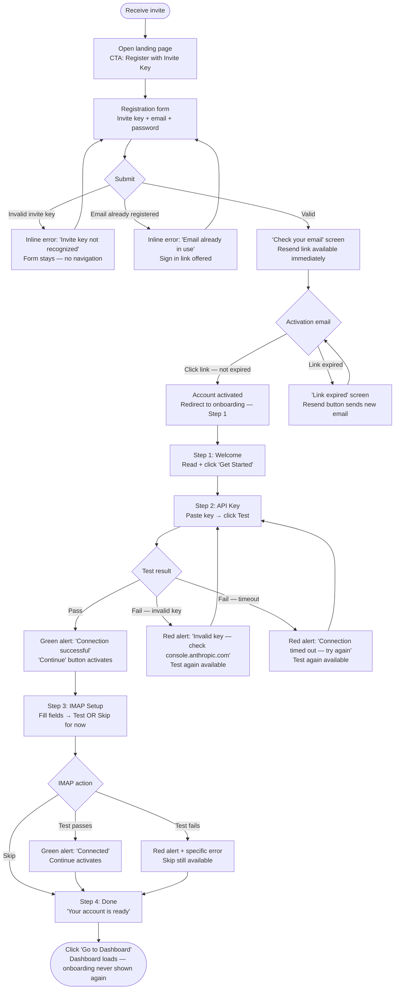
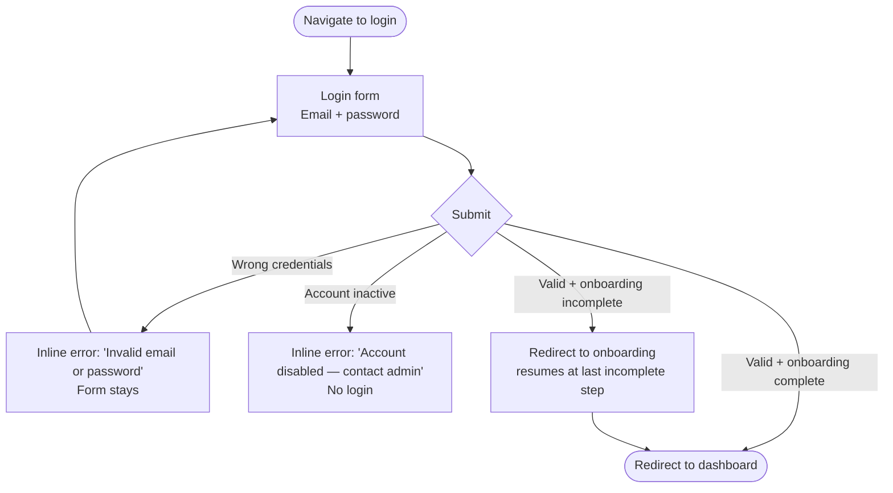
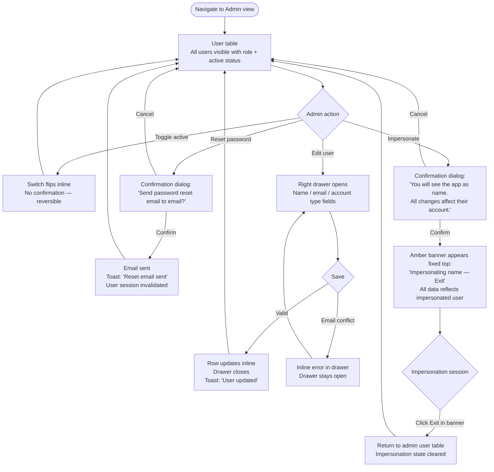

# UX Design Specification — Auth, Onboarding & Admin Surfaces

**Author:** Stryker  
**Date:** 2026-04-26  
**Scope:** Epics 24–26 (multi-user platform expansion)  
**Design Direction:** Direction A — Minimal Centered (all surfaces)

This document extends the existing UX specification for the new surfaces introduced by the multi-user platform expansion. All existing design decisions (zinc-950 dark mode, Inter, shadcn/ui, Elevated Card direction) apply and are not repeated here.

---

## Executive Summary

### Project Context

The Job Hunt Dashboard is graduating from a single-user localhost tool to a small hosted platform for ~10 invited users. Epics 24–26 introduce six new surfaces that do not exist in the current app: landing page, registration, email verification, login, onboarding (4 steps), and admin user management view.

### Target Users for New Surfaces

| Persona | Context | Goal |
|---|---|---|
| **Invited new user** | Has a physical invite key; wants to start using the app | Register → activate → get set up → reach the dashboard with zero admin intervention |
| **Returning standard user** | Has an active account | Log in fast; no interruption |
| **Admin (Stryker)** | Manages the platform | See user status at a glance; handle support issues without leaving the app |

### Key Design Challenges

1. **Public/private seam** — Landing, registration, and login are public-facing pages that must feel coherent with the dense, data-focused app interior without looking like a marketing site grafted onto a utility tool.
2. **Onboarding as a gate** — Users must complete onboarding before the app is usable. The 4-step flow includes live connection tests. Getting stuck on an IMAP test failure is the highest-risk friction point.
3. **Live test feedback** — Both the Anthropic API key step and the IMAP step require a live test. The idle → testing → pass/fail state transition is the most interactive moment in the entire new flow.
4. **Impersonation context** — When an admin impersonates a user, there must be an unmistakable signal that the context has shifted, with an always-visible escape hatch.

### Design Opportunities

1. **Onboarding as a warm welcome** — The invite-key model creates a moment of exclusivity. The landing page confirms "you're in the right place" without selling the product.
2. **Progress-signaled onboarding** — A 4-step linear flow with a clear step indicator gives users a sense of finishability. Contrast with the stress of job hunting — this should feel completable in 5 minutes.
3. **Admin impersonation as a debugging superpower** — Admins can see exactly what a user sees, which means problems can be diagnosed without guesswork.

---

## Core User Experience

### Defining Experience

Every new surface is a gate to the dashboard. The entire new UX has one job: get a new invited user from email → dashboard without confusion, dead ends, or support needed.

The defining moment is the **API key test passing** — a user who was invited, registered, verified their email, entered their Anthropic API key, and sees green. That moment is the emotional peak of the entire new-user journey. If this moment is uncertain, slow, or ambiguous, users will doubt whether the app is actually working for them.

### Platform Strategy

Auth screens (landing, registration, login, activation redirect) must be mobile-capable — users click email links on phones. Onboarding and admin are desktop-primary. The existing app shell and core app remain desktop-only.

Auth form cards use `max-w-sm` — naturally mobile-safe without responsive variants. No breakpoints required.

### Effortless Interactions

- **Live test feedback** on API key and IMAP must be unmistakable — not a spinner that stalls, not an error buried in a paragraph.
- **IMAP skip** is a first-class choice, not a footnote. Invited users won't all have IMAP credentials ready at onboarding time.
- **Impersonation escape** is always-visible and one-click. An admin who forgets they're impersonating could create real confusion.

### Critical Success Moments

| Moment | Why it matters |
|---|---|
| "Check your email" confirmation after registration | User knows they're on the right path; no "did it work?" anxiety |
| API key test returns green | First live signal the user's account is functional; high relief/trust moment |
| "You're all set" done screen | Closure — user knows onboarding is finished and the app is ready |
| Admin: user table loads with clear active/inactive status | Single glance answers "who's active, who's not" |

### Experience Principles

1. **Gates should be doorways, not walls** — Every auth screen makes the next step obvious; no dead ends without a clear re-entry path.
2. **Live feedback is trust** — Any action that touches an external system (API key test, IMAP test) shows state change immediately; uncertainty = abandon.
3. **Onboarding has a finish line** — Progress through 4 steps is visible; users know how far they are and that it ends.
4. **Admin context is always explicit** — Normal app state and admin state are never ambiguous; impersonation banners and admin-only nav are persistent, not transient.

---

## Desired Emotional Response

### Primary Emotional Goals

- **Registration → Confidence** — The invite key is a trust signal; the registration form should feel like a secure handshake, not a bureaucratic form. User should feel: "I was expected."
- **Onboarding → Empowerment building toward relief** — The API key test passing is the emotional peak. User should feel: "I set this up myself and it works."
- **Admin → Calm authority** — Same energy as the core app. User should feel: "I can see everything I need; nothing is hidden."

### Emotional Journey Mapping

| Stage | Desired Emotion | Trigger |
|---|---|---|
| Landing page | Orientation, mild anticipation | Simple layout confirms "this is the app I was invited to" |
| Entering invite key | Belonging | Key is accepted — visual confirmation, not a loading wait |
| "Check your email" screen | Trust, not anxiety | Clear next-step instruction; re-send available immediately |
| Email activation click | Relief, momentum | Single click activates — redirect to onboarding |
| Onboarding step indicator | Progress, finishability | User sees dots: 1 complete, 2 active, 3-4 pending |
| API key test passing | Relief, confidence | Green state change; account is wired up |
| IMAP step skip | Freedom, not guilt | Skip is a first-class action, not an apology |
| "You're all set" | Closure, anticipation | Onboarding is done; CTA takes them to dashboard |
| Admin user table | Control, clarity | All users visible at a glance with clear active/inactive state |
| Impersonation active | Heightened awareness | Persistent amber banner: can't miss it, can't accidentally ignore it |

### Micro-Emotions to Target

- **Belonging over formality** — Registration should feel like arriving, not applying
- **Confidence over uncertainty** — Every test (API key, IMAP) resolves to definitive pass or fail; no ambiguous states
- **Progress over endlessness** — 4 onboarding steps with explicit dots; no "how much is left?"
- **Authority over anxiety** — Admin impersonation has a clear escape; destructive-feeling actions have weight-appropriate friction

### Emotions to Avoid

- **"Did it send?"** anxiety on the activation email screen — re-send available immediately, no timer gate
- **"Is my key wrong?"** uncertainty during API key test — distinguish "invalid key" from "network error" from "timeout"
- **"Am I impersonating right now?"** confusion — amber banner is always-visible, not a toast

### Design Implications

| Emotion Goal | UX Approach |
|---|---|
| Belonging on landing | Single-page, no marketing copy — just "You were invited. Here's how to get started." |
| Confidence from test | API key and IMAP test buttons show explicit pass (emerald) / fail (red) state, not just "error message below" |
| Progress in onboarding | Fixed dot indicator at top; completed steps filled emerald; current step filled blue |
| Calm authority in admin | Same zinc card table pattern as the core app; admin-specific actions in a consistent inline action column |
| Impersonation awareness | Persistent `bg-amber-900/80 border-amber-700` banner fixed to the top of every page while active |

---

## UX Pattern Analysis & Inspiration (New Surfaces)

### Inspiring Products Analysis

**Vercel**
- Dark theme, minimal registration — email + password on a single centered card, no marketing noise
- API token management: tokens shown once at creation, copy button prominent, test connection is a single button that resolves to green/red
- Team member invites have clear "pending" states until accepted

**Linear**
- Onboarding is numbered steps (1 of N) with each screen having a single focused action
- Step completion acknowledged with a subtle animation before moving to the next — tight feedback loop
- Keyboard shortcut to advance steps — power users not blocked by forced mouse interaction

**Supabase**
- Auth users table is a compact dark card table — exactly the existing card pattern, extended with email verification status, created date, last sign-in
- User active/inactive toggle is an inline switch in the table row — no modal, no navigation
- Connection string testing uses an explicit "Test connection" button that returns a green banner or a specific error code

### Transferable UX Patterns

**Registration / Login:**
- Vercel's single centered card — dark `zinc-900` card on `zinc-950` background, no sidebar, no decorative elements
- Form width `max-w-sm` (~384px) — consistent with how Vercel/Linear handle this

**Onboarding:**
- Linear's single-action-per-screen rule — API key screen does one thing: enter key, test, confirm
- Vercel's test connection button pattern: button → loading state → explicit pass (emerald) or fail (red + specific error message)

**Admin user table:**
- Supabase auth table layout adapted: same zinc card container as core app, columns for name / email / account type / active / last login / actions
- Inline active toggle (shadcn `Switch`) — same row, no navigation

### Anti-Patterns to Avoid

- **Multi-step registration forms** — invite key + email + password all fit on one screen; splitting creates abandonment risk
- **Onboarding that exits the browser** — IMAP setup screen should provide provider hints (e.g., "Use imap.gmail.com port 993 for Gmail")
- **Ambiguous test state** — spinner without timeout; 10-second timeout max, then explicit timeout error
- **Admin actions in modals** — edit user opens a side drawer (consistent with existing JobDrawer pattern)
- **Impersonation as a normal menu item** — visually separated (amber/warning styling) and requires confirmation

### Design Inspiration Strategy

**Adopt directly:**
- Vercel's centered dark card for registration/login forms
- Linear's dot step indicator for onboarding
- Supabase's inline Switch for active toggle in admin table
- Vercel's test connection button → explicit pass/fail pattern for API key and IMAP steps

**Adapt:**
- Supabase auth user table → admin view using the existing `rounded-lg border border-zinc-800 bg-zinc-900` card pattern
- Linear's step completion acknowledgement → subtle dot color transition on advance

**Avoid:**
- Multi-page registration
- Spinner-without-timeout on connection tests
- Modal dialogs for admin edit actions (use drawer)

---

## Design System Foundation (Additions)

The design system is shadcn/ui + Tailwind CSS, established in the existing spec. New surfaces add:

### New shadcn Components to Install

```bash
bunx shadcn@latest add form input label switch alert dialog avatar
```

| Component | Usage |
|---|---|
| `Form` + `Input` + `Label` | Registration, login, onboarding forms |
| `Switch` | Admin user list active toggle |
| `Alert` | Connection test pass/fail result; registration success message |
| `Dialog` | Admin: confirm reset password; confirm impersonate |
| `Avatar` | Admin user table — initials fallback |

### New Semantic Color Tokens

| Token | Usage | Tailwind |
|---|---|---|
| `--test-pass` | Connection test success | `emerald-500` (reuses `--score-high`) |
| `--test-fail` | Connection test failure | `red-500` (reuses `--score-low`) |
| `--impersonate-bg` | Impersonation banner background | `amber-900/80` |
| `--impersonate-border` | Impersonation banner border | `amber-700` |

### Form Input Styling

```
Input:  border border-zinc-700 bg-zinc-800 text-zinc-100 rounded-md
        focus:ring-2 focus:ring-blue-600 focus:border-transparent
Label:  text-xs font-medium text-zinc-400 (above input)
Error:  text-xs text-red-400 mt-1 role="alert"
```

---

## Visual Design Foundation (Additions)

### New Typography Roles

| Role | Size | Weight | Usage |
|---|---|---|---|
| Form card heading | `text-base` (16px) | `font-semibold` | "Create your account", "Sign in" |
| Onboarding step title | `text-lg` (18px) | `font-semibold` | "Connect your Anthropic API key" |
| Helper / hint text | `text-xs` (12px) | `font-normal` | "Use imap.gmail.com port 993 for Gmail" |
| Landing headline | `text-base` (16px) | `font-semibold` | App name on landing — no large display text |

No large display text. Landing page is not a marketing page — same type scale as the rest of the app.

### New Layout Patterns

**Auth form card (registration, login, "check email"):**
```
outer:  flex min-h-screen items-center justify-center bg-zinc-950 px-4
card:   w-full max-w-sm rounded-lg border border-zinc-800 bg-zinc-900 p-8
fields: space-y-4
CTA:    w-full mt-6
```

**Onboarding layout:**
```
outer:  flex min-h-screen items-center justify-center bg-zinc-950 px-4
card:   w-full max-w-md rounded-lg border border-zinc-800 bg-zinc-900 p-8
steps:  StepIndicator component at top, mb-6
fields: space-y-5
actions: flex gap-3 justify-end mt-8
```

**Admin view layout:**
```
Full-width card within existing authenticated app shell (same header + nav)
Card: rounded-lg border border-zinc-800 bg-zinc-900 overflow-hidden
No separate admin shell — admin is a view within the existing layout
```

**Impersonation banner:**
```
fixed top-0 left-0 right-0 z-50 h-10
bg-amber-900/80 border-b border-amber-700
flex items-center justify-between px-4 gap-4
main content: pt-10 when banner is active
```

---

## Design Direction Decision

### Chosen Direction: A — Minimal Centered (all surfaces)

- **Landing:** Single centered CTA, no app branding or value prop copy on the page
- **Registration / Login:** Narrow card (`max-w-sm`), plain label-above-input fields, no decoration, no app logo
- **Onboarding:** Dot step indicator, clean `max-w-md` card, test result as inline Alert block below input
- **Admin:** Explicit inline action buttons in table row — Edit / Reset PW / Impersonate

### Design Rationale

The core app is a focused utility tool — dense, neutral, purposeful. The auth surfaces must feel like they belong to the same product, not like a different app's login screen was bolted on. Minimal Centered achieves this: no decorative chrome, no marketing framing, the same zinc palette the user will see for every session after login.

The invite-only model also removes any need to "sell" the product on the landing page — users who arrive already have an invite key. Zero marketing copy is the correct choice.

### Implementation Approach

- Auth form card: `rounded-lg border border-zinc-800 bg-zinc-900 p-8` — identical surface token to the existing Elevated Card
- Dot step indicator: custom `StepIndicator` component — 8px dots, emerald/blue/zinc-700
- Inline action buttons in admin: explicit text buttons in a fixed action column, not a 3-dot menu
- Impersonation: amber strip fixed top, always rendered when `impersonating` context is set

---

## User Journey Flows

### Journey 4: First-Time User Setup

The primary new journey. Entry is an invite; exit is the dashboard ready to use.



**Flow optimizations:**
- Invite key error resolves inline; no page change — user fixes it in place
- Resend available from the "check your email" screen immediately, no timer gate
- Continue on the API key step is disabled until the test passes — cannot skip
- IMAP skip is a primary-weight button, not a text link

---

### Journey 5: Login (Returning User)



---

### Journey 6: Admin User Management



### Journey Patterns (New Surfaces)

- **Gate → verify → proceed:** Registration and onboarding follow a linear gate model — each step must pass before the next is reachable.
- **Inline error, no navigation:** All form errors resolve on the current screen. No redirect to an error page.
- **Test before commit:** API key and IMAP steps require an explicit test action before the primary CTA activates.
- **Confirmation for irreversible admin actions:** Toggle (reversible) = no confirmation. Reset password / Impersonate (consequences that affect another user's account) = confirmation dialog.

### Flow Optimization Principles

- **Inline error recovery** — every error path returns the user to the same form state with the error shown; zero navigation to recover
- **Skip is always primary-weight** — never demote "skip" to a text link or secondary button when it's a valid and common path
- **Admin confirmation dialogs state the consequence, not the action** — "This will send a reset email and invalidate [user]'s current session" rather than "Are you sure?"

---

## Component Strategy

### New shadcn/ui Components

Install: `bunx shadcn@latest add form input label switch alert dialog avatar`

| Component | Usage in new surfaces |
|---|---|
| `Form` + `Input` + `Label` | All auth and onboarding forms |
| `Switch` | Admin active/inactive toggle |
| `Alert` | Connection test results, registration success |
| `Dialog` | Reset password and impersonate confirmations |
| `Avatar` | Admin table initials avatar |

### Custom Components

#### `<StepIndicator>`

**Purpose:** Shows progress through the 4-step onboarding flow. shadcn `Progress` is a linear bar — not the right pattern.

**Anatomy:** Row of 4 circular dots connected by thin lines.

**States per dot:**
- `done` — `bg-emerald-500` filled circle
- `active` — `bg-blue-500` filled circle  
- `pending` — `bg-zinc-700` filled circle

**Connecting lines:** `flex-1 h-px` — `bg-emerald-500` between done steps, `bg-zinc-700` otherwise.

**Accessibility:** `role="list"` container with `aria-label="Onboarding progress: step N of 4"`. Each dot is `role="listitem"` with `sr-only` text: "[Step name]: [done/current/upcoming]". `aria-current="step"` on active dot.

**Props:** `currentStep: 1 | 2 | 3 | 4`

---

#### `<ConnectionTestButton>`

**Purpose:** Encapsulates the idle → loading → pass/fail state machine for API key and IMAP connection tests.

**States:**

| State | Button | Alert below input |
|---|---|---|
| `idle` | `border border-zinc-700 text-zinc-400` "Test Connection" | None |
| `loading` | Disabled, spinner, "Testing…" | None |
| `pass` | `border border-emerald-600 text-emerald-400 bg-emerald-950/30` "✓ Connected" | `<Alert>` "Connection successful" |
| `fail` | `border border-red-700 text-red-400 bg-red-950/30` "✗ Failed" | `<Alert variant="destructive">` specific error |

**Behaviour:**
- 10-second timeout treated as network error
- Pass state calls `onPass()` prop to enable parent Continue button
- State resets to `idle` when the connected input field value changes
- `aria-live="polite"` region announces result to screen readers

**Props:** `onTest: () => Promise<{ ok: boolean; error?: string }>`, `onPass: () => void`

---

#### `<ImpersonationBanner>`

**Purpose:** Persistent fixed-top indicator that an admin is viewing the app as another user.

**Styling:**
```
fixed top-0 left-0 right-0 z-50 h-10
bg-amber-900/80 border-b border-amber-700
flex items-center justify-between px-4 gap-4
```

**Layout impact:** When mounted, `<main>` receives `pt-10` class.

**Content:** Left: "Impersonating [Name]" (`truncate flex-1`). Right: "Exit" button (`border border-amber-700 text-amber-300 text-xs`).

**Accessibility:** `role="alert"` + `aria-live="assertive"` on mount — screen readers immediately announce impersonation state.

**Exit:** `POST /api/admin/impersonate/exit` → redirect to `/admin/users`.

---

#### `<AuthFormCard>`

**Purpose:** Layout wrapper for login, registration, and activation-related screens.

```tsx
// outer: flex min-h-screen items-center justify-center bg-zinc-950 px-4
// card:  w-full max-w-sm rounded-lg border border-zinc-800 bg-zinc-900 p-8
```

Simple layout component. No interactivity. Props: `children`, optional `className` for card overrides.

---

### Implementation Roadmap

**Epic 24 (auth foundation):**
1. `AuthFormCard` — needed for registration, login, activation screens
2. `Form` / `Input` / `Label` / `Alert` installs — all auth forms
3. `Dialog` install — admin confirmations (can stub until Epic 26)

**Epic 25 (onboarding):**
4. `StepIndicator` — onboarding entry point component
5. `ConnectionTestButton` — build and test in isolation first; most stateful new component

**Epic 26 (admin view):**
6. `Switch` + `Avatar` installs — admin user table
7. `ImpersonationBanner` — last to build; depends on impersonation API endpoint

---

## UX Consistency Patterns (New Surfaces)

### Form Patterns

| Rule | Specification |
|---|---|
| **Validation timing** | Validate on blur, not on keystroke |
| **Error placement** | Inline below the field — `text-xs text-red-400 mt-1 role="alert"` |
| **Required fields** | All auth form fields are required. No asterisks — omit optional fields instead |
| **Submit disabled state** | Never disable submit for validation — allow attempt, then show errors. Exception: Continue after test pass is gated. |
| **Field order** | Registration: invite key → email → password. Login: email → password. |
| **Password field** | Always `type="password"`. No show/hide toggle for MVP. |
| **Invite key field** | `font-mono`, `placeholder="XXXX-XXXX-XXXX"`. Trim whitespace on submit. |

### Connection Test Patterns

| State transition | Trigger | Max duration |
|---|---|---|
| `idle → loading` | User clicks Test | Immediate |
| `loading → pass` | API returns success | As soon as response arrives |
| `loading → fail` | API returns error OR timeout | 10 seconds max |
| `pass/fail → idle` | User edits input field | Immediate on change |

**Error message specificity — forbidden:** generic "Something went wrong". Required specificity:

| Condition | Message |
|---|---|
| 401 / invalid key | `"Invalid key — verify at console.anthropic.com"` |
| Timeout | `"Connection timed out — check your network and try again"` |
| 5xx | `"Server error — try again in a moment"` |
| IMAP auth failure | `"Authentication failed — check username and password"` |
| IMAP host unreachable | `"Cannot reach host — verify server address and port"` |

### Onboarding Gate Patterns

| Rule | Specification |
|---|---|
| API Key step is hard-gated | Continue disabled until test passes. Cannot advance with untested or failed key. |
| IMAP step is soft-gated | Skip and Continue (after pass) are equal-weight primary actions |
| Back is always available | Steps 2–4 each have Back. Back does not reset current step state. |
| Step persistence | User resumes at last incomplete step on next login if they leave mid-flow |
| Done screen is terminal | Once shown, onboarding is marked complete. No back navigation to onboarding steps. |

### Admin Action Patterns

| Action | Confirmation? | Rationale |
|---|---|---|
| Toggle active | No | Immediately visible; instantly reversible |
| Edit user | No modal — save within drawer | Drawer is the confirmation step |
| Reset password | Yes — Dialog | Triggers external email; invalidates another user's session |
| Impersonate | Yes — Dialog | Shifts context to another user's account |
| Generate invite key | No | Single-action, low stakes, easily revoked if sent to wrong person |
| Revoke invite key | Yes — Dialog | Permanently deletes key; consequence copy: "This invite key will be permanently deleted and cannot be used to register." |

**Confirmation dialog copy rule:** State the consequence, not the action. "This will send a reset email and invalidate [user]'s current session." Not "Are you sure you want to reset the password?"

**Impersonation banner rules:**
- Shown on every page while active — not just the admin view
- `z-50` — always above app content including fixed header
- Cannot be dismissed; only "Exit" removes it
- Exit always navigates to `/admin/users`, not "back"

### Button Hierarchy

| Level | Style | Usage |
|---|---|---|
| **Primary** | `bg-blue-600 text-white` | One per screen max: "Create account", "Continue →", "Go to Dashboard" |
| **Secondary** | `border border-zinc-700 text-zinc-400` | "Back", "Test again", "Skip for now" |
| **Destructive (admin)** | `border border-amber-700 text-amber-400` | "Impersonate" button in admin table |
| **Ghost / link** | `text-zinc-500 hover:text-zinc-300` | "Already have an account? Sign in" |

Rule: never more than one primary button per screen. Disabled state is reserved for explicit gates only (Continue until test passes) — not for form validation hints.

---

## Responsive Design & Accessibility

### Responsive Strategy

| Surface | Requirement |
|---|---|
| Landing, Registration, Login, "Check email" | Mobile-capable — users click email links on phones |
| Activation redirect | Redirect only — no layout |
| Onboarding (4 steps) | Desktop-primary; `max-w-md` single-column card works at 375px without changes |
| Admin view | Desktop-only — consistent with core app decision |

**Auth card pattern is mobile-safe by construction.** `max-w-sm` (384px) with `px-4` outer padding fills a 375px screen without overflow. No responsive breakpoints needed.

### Breakpoint Strategy

No new breakpoints. The existing spec has none (desktop-only). Auth card approach makes mobile work without breakpoints.

**ImpersonationBanner:** Username text uses `truncate flex-1` — never wraps or pushes Exit button off-screen at any width.

### Accessibility Strategy

Target: **WCAG AA** — consistent with existing spec.

**Form input accessibility:**
```tsx
<Label htmlFor="email">Email</Label>
<Input
  id="email"
  aria-describedby={error ? "email-error" : undefined}
/>
{error && (
  <p id="email-error" role="alert" className="text-xs text-red-400 mt-1">
    {error}
  </p>
)}
```

Every input has `id` + matching `htmlFor` on its label. Error messages use `role="alert"` — screen readers announce without requiring focus.

**ConnectionTestButton accessibility:**
```tsx
<div aria-live="polite" aria-atomic="true" className="sr-only">
  {testState === 'pass' && 'Connection successful'}
  {testState === 'fail' && `Connection failed: ${errorMessage}`}
</div>
```

Visible Alert communicates visually; `aria-live` region communicates to screen readers. Both required.

**StepIndicator accessibility:**
```tsx
<div role="list" aria-label={`Onboarding progress: step ${currentStep} of 4`}>
  {steps.map(step => (
    <div role="listitem" aria-current={step.active ? "step" : undefined}>
      <span className="sr-only">{step.label}: {step.status}</span>
      {/* visual dot */}
    </div>
  ))}
</div>
```

**ImpersonationBanner accessibility:**
```tsx
<div role="alert" aria-live="assertive" aria-atomic="true">
  Impersonating {userName} —
  <button onClick={exitImpersonation}>Exit impersonation</button>
</div>
```

`aria-live="assertive"` — screen reader users are immediately interrupted; the state change is too significant to announce politely.

**Dialog accessibility:** shadcn Dialog (Radix) handles focus trap, `aria-modal`, `aria-labelledby`, Escape key. Add `aria-describedby` pointing to the consequence sentence in the dialog body.

**Focus management in onboarding:** On step advance, move focus to the step's `<h2>` heading:
```tsx
useEffect(() => { headingRef.current?.focus(); }, [currentStep]);
// h2: tabIndex={-1} to allow programmatic focus without adding to tab order
```

**Pass/fail state — color + icon rule:** Test pass/fail states communicate via color AND icon (✓ / ✗) — not color alone. WCAG requirement; also benefits users in bright ambient light.

**Onboarding step indicator — color + text rule:** Step completion communicates via color AND sr-only text — not color alone.

### Implementation Guidelines

- Form inputs maintain existing WCAG AA contrast (zinc-100 text on zinc-800 input background)
- All interactive elements maintain minimum 44×44px touch targets on mobile
- `Dialog` receives focus on open; focus returns to trigger element on close (Radix handles this)
- `ImpersonationBanner` Exit button is reachable by keyboard without traversing the entire page (it is the second focusable element in the DOM after the banner mounts)

---

*Document complete. Spec covers Epics 24–26: auth foundation, onboarding, and admin view.*
