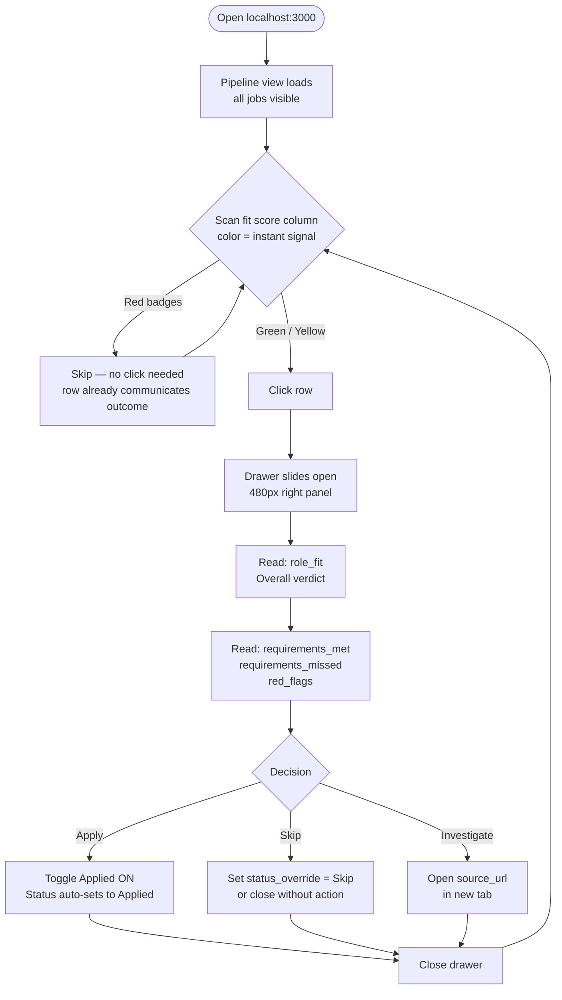
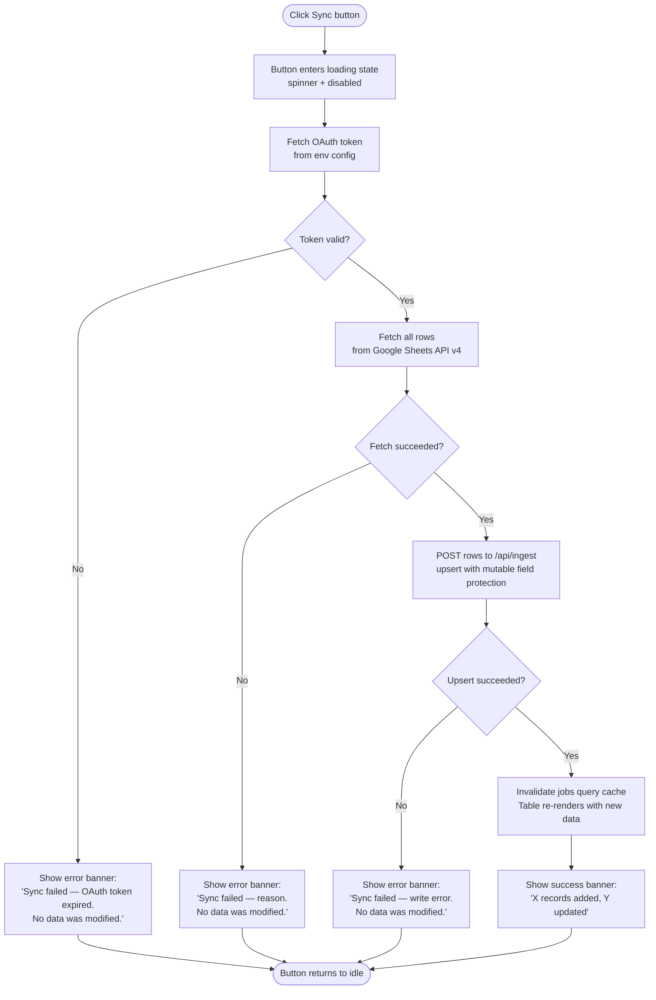
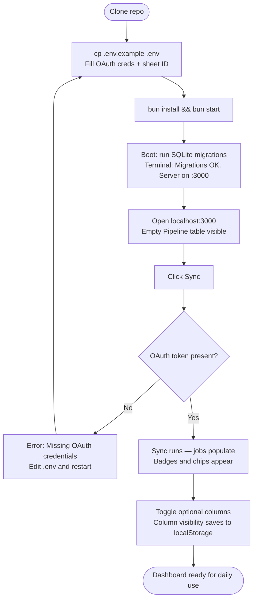

# User Journey Flows

## Journey 1: Daily Triage

The primary loop. Entry is the Pipeline view; the exit is either a decision recorded or the tab closed.

**Flow optimizations:**
- Score badge color resolves most decisions before the drawer opens — the drawer is for confirmation, not discovery
- Applied toggle is at the bottom of the drawer; user reads the full record before the action is reachable
- Closing the drawer without action is a valid non-decision — no forced choice

## Journey 2: Manual Sync

Triggered by the Sync button. Two branches: success and auth/network failure.

**Flow optimizations:**
- Every failure path guarantees no partial writes — atomic-or-nothing semantics
- Success banner shows counts (not just "done") — gives confidence the sync was meaningful
- Second sync immediately after is safe; idempotent result shown

## Journey 3: First-Run Setup

Single-session bootstrap from clone to live data.

## Journey Patterns

**Decision before action:** Every state-changing action (applied toggle, status override) is positioned below the full record in the drawer. The user reads before they act — layout enforces this.

**Non-action is valid:** Closing the drawer without toggling anything is a valid "investigate later" signal. No forced confirmation dialogs.

**Error isolation:** All sync errors include "No data was modified" — removes anxiety about running sync repeatedly.

**Score-first scanning:** The leftmost prominent column is always the fit score badge. Color is absorbed before text is read in any view.

## Flow Optimization Principles

- **Reduce time-to-first-decision:** Score color resolves ~60% of records without opening a drawer
- **Drawer = confirmation, not discovery:** The user already suspects "apply" or "skip" before clicking — the drawer provides evidence, not the verdict
- **No modals, no confirmations:** Applied toggle and status override are direct writes; undo is just toggling back
- **Sync is always safe to re-run:** Idempotent upsert removes hesitation about hitting Sync more than once

---
